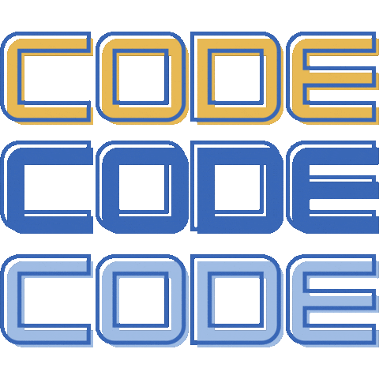

<h1>👋 Hello, I'm Abdelkarim Ain</h1>

   

I'm **Abdelkarim Ain**, a FullStack Developer from Morocco, with experience in **JavaScript**, **Laravel**, **React.js** and passion for **PHP**, **Java** and more. If you're interested or have any questions, feel free to reach out I’d be happy to connect! 

#### 📫 Contact Me on Social Media

## 📚 Tech Stack:

## 📊 GitHub Stats

